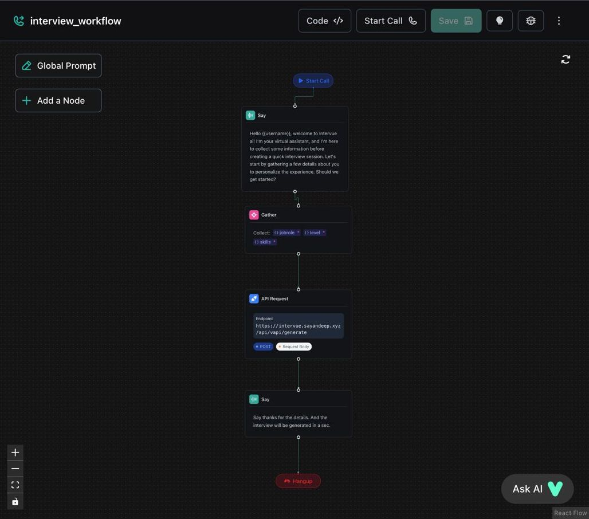

# Intervue AI

Intervue AI is a real-time AI-powered interview platform built with **Next.js**, **Vapi**, **Vercel AI SDK**, and integrated with multiple AI services including OpenAI, Google Generative AI, AssemblyAI, Deepgram, and ElevenLabs.

It simulates an AI interviewer that talks to users in real-time and generates insights and transcripts from the conversation.

## 🧠 Features

- Real-time AI interviewer powered by [Vapi](https://www.vapi.ai)
- Uses multiple AI APIs: OpenAI, Google Gemini, Deepgram, ElevenLabs
- Transcription and voice synthesis
- Google authentication with NextAuth
- Full-stack application using PostgreSQL (Neon)

---

## 🛠 Tech Stack

- **Frontend:** Next.js, Tailwind CSS, Vercel AI SDK
- **Backend:** Node.js, PostgreSQL (Neon DB), Vapi, AI APIs
- **Auth:** NextAuth with Google Provider
- **Hosting:** Vercel

---

## 🔧 Setup Instructions

### 1. Clone the Repository

```bash
git clone https://github.com/your-username/intervue-ai.git
cd intervue-ai
```


**2\. Install Dependencies**

```
npm install
```

### **3\. Setup Environment Variables**

Create a .env file in the root of the project and add the following variables. Refer to .env.example for structure down below.


### **4\. Set Up a Vapi Workflow** 


-  This is to collect data before creating the interview 

-   Go to [Vapi.ai](https://www.vapi.ai)

-   Create a new **workflow** that defines your create interview logic

-   Copy the **workflow ID** and paste it into NEXT_PUBLIC_VAPI_WORKFLOW_ID

* * * * *

**🧪 Development**
------------------

```
npm run dev
```

* * * * *


**📄 Environment variables**
--------------


```env
# PostgreSQL Database URL
DATABASE_URL="postgresql://<username>:<password>@<host>/<db_name>?sslmode=require"

# Google OAuth
GOOGLE_CLIENT_ID=your_google_client_id
GOOGLE_CLIENT_SECRET=your_google_client_secret

# NextAuth Secret
NEXTAUTH_SECRET=your_nextauth_secret

# Google Generative AI
GOOGLE_GENERATIVE_AI_API_KEY=your_google_gen_ai_key

# Vapi Integration
NEXT_PUBLIC_VAPI_WORKFLOW_ID=your_vapi_workflow_id
NEXT_PUBLIC_VAPI_API_KEY=your_vapi_api_key

# ElevenLabs API
ELEVEN_API_KEY=your_elevenlabs_api_key

# OpenAI API
OPENAI_API_KEY=your_openai_api_key


# Deepgram API
DEEPGRAM_API_KEY=your_deepgram_api_key
```

* * * * *
