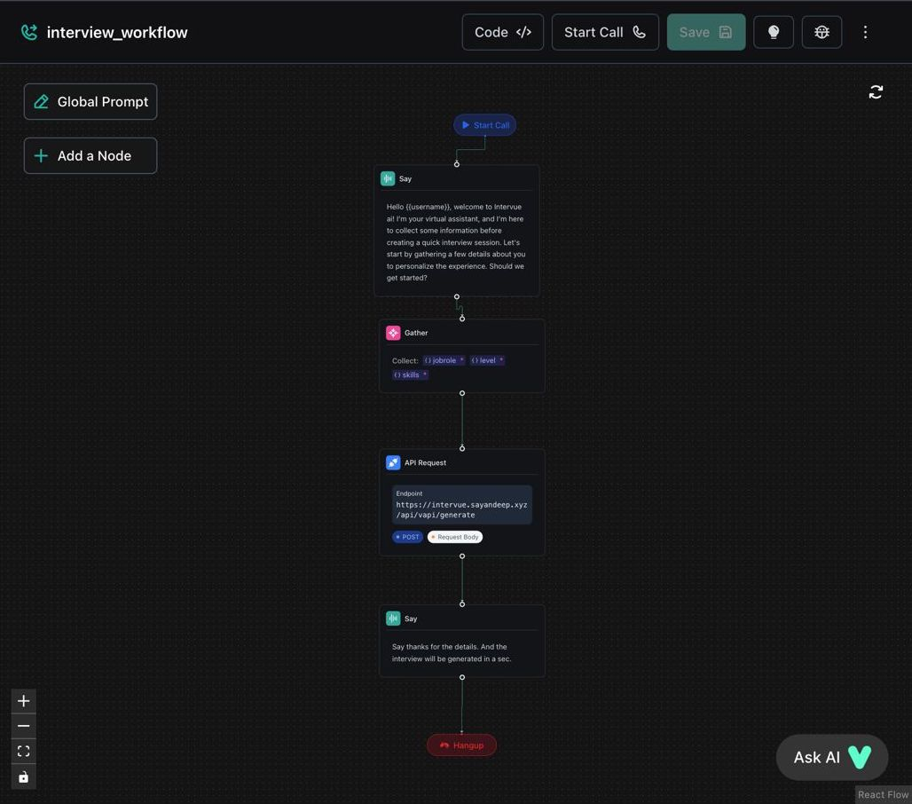

# InterVue - AI-Powered Interview Platform

InterVue is a modern AI-powered interview platform built with **Next.js**, **Vapi**, and integrated with multiple AI services including OpenAI, Google Generative AI, Deepgram, and ElevenLabs.

The platform enables companies to conduct intelligent interviews with AI-generated questions, real-time voice interactions, and comprehensive candidate analysis.

## ✨ Features

- **AI Question Generation**: Create role-specific interview questions automatically
- **Real-time Voice Interviews**: Powered by [Vapi](https://www.vapi.ai) for natural conversations
- **Smart Analytics**: Detailed candidate performance analysis and feedback
- **Professional UI**: Clean, modern interface with dark/light mode support
- **Multiple AI Integrations**: OpenAI, Google Gemini, Deepgram, ElevenLabs
- **Authentication**: Secure Google OAuth with NextAuth
- **Full-Stack Solution**: PostgreSQL database with modern web technologies

---

## 🛠 Tech Stack

- **Frontend:** Next.js 15, TypeScript, Tailwind CSS, Radix UI
- **Backend:** Node.js, PostgreSQL (Neon DB), Prisma ORM
- **AI Services:** Vapi, OpenAI, Google Gemini, Deepgram, ElevenLabs  
- **Auth:** NextAuth.js with Google OAuth
- **Deployment:** Vercel

---

## 🔧 Setup Instructions

### 1. Clone the Repository

```bash
git clone https://github.com/Sayandeep06/mercor
cd mercor
```

### 2. Install Dependencies

```bash
npm install
```

### 3. Setup Environment Variables

Create a `.env.local` file in the root directory and add the required environment variables (see Environment Variables section below).

### 4. Database Setup

Set up your PostgreSQL database (recommended: [Neon](https://neon.tech)) and run the database migrations:

```bash
npx prisma migrate dev
npx prisma generate
```

### 5. Configure Vapi Integration



- Go to [Vapi.ai](https://www.vapi.ai) and create an account
- Set up your AI voice assistant configuration  
- Copy your API keys and add them to your environment variables

* * * * *

## 🚀 Development

Start the development server:

```bash
npm run dev
```

Open [http://localhost:3000](http://localhost:3000) in your browser to see the application.

---

## 📄 Environment Variables

Create a `.env.local` file with the following variables:

```env
# PostgreSQL Database URL
DATABASE_URL="postgresql://<username>:<password>@<host>/<db_name>?sslmode=require"

# Google OAuth
GOOGLE_CLIENT_ID=your_google_client_id
GOOGLE_CLIENT_SECRET=your_google_client_secret

# NextAuth Secret
NEXTAUTH_SECRET=your_nextauth_secret

# Google Generative AI
GOOGLE_GENERATIVE_AI_API_KEY=your_google_gen_ai_key

# Vapi Integration
NEXT_PUBLIC_VAPI_WORKFLOW_ID=your_vapi_workflow_id
NEXT_PUBLIC_VAPI_API_KEY=your_vapi_api_key

# ElevenLabs API
ELEVEN_API_KEY=your_elevenlabs_api_key

# OpenAI API
OPENAI_API_KEY=your_openai_api_key


# Deepgram API  
DEEPGRAM_API_KEY=your_deepgram_api_key
```

---

## 🎯 How It Works

1. **Create Interview**: Define job role, experience level, and required skills
2. **AI Generation**: System generates targeted interview questions using Google Gemini
3. **Conduct Interview**: Real-time voice conversation powered by Vapi AI
4. **Get Insights**: Comprehensive analysis and feedback on candidate performance

---

## 👤 Author

**Sayandeep Dey**
- GitHub: [@Sayandeep06](https://github.com/Sayandeep06)
- LinkedIn: [Sayandeep Dey](https://www.linkedin.com/in/sayandeep-dey-2a0aba227/)
- Twitter: [@gitpushsayan](https://x.com/gitpushsayan)
- Email: deysayandeepdev@gmail.com

---

